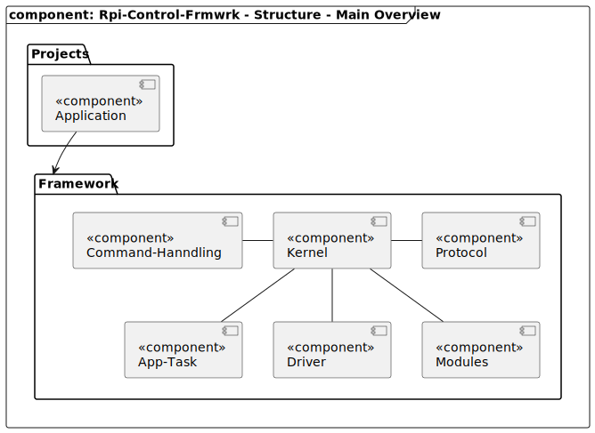

### Location
frmwrk /

# Content

# Brief
The RPi-Control framework contains common modules, drivers and other implementations that are used by the RPi-Control projects. The framework provides a basic operating system to run different task like components and a Signal-Slot mechanism to transfer data from one modul to another.

# Features
- 

# Main Structure

| Component                                  | Description |
|--------------------------------------------|-------------|
| Application                                |             |
| App-Task                                   |             |
| Command-Handling                           |             |
| Driver                                     |             |
| [kernel](readme/readme_kernel.md#location) |             |
| [modules](readme/readme_modules.md#location) |             |
| Protocol                                   |             |
