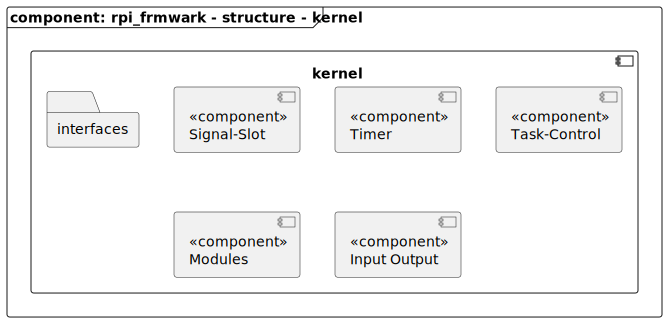

[TOP]: #section "Go to the top of the page"

### Section

Readme | [Changelog](../changelog.md)

### Location
[frmwrk](../README.md) / kernel / 

# Kernel

## Brief
[[TOP]]

## Integration
[[TOP]]

### Makefile

## Usage

## Structure
[[TOP]]

| Component                                  | Description |
|--------------------------------------------|-------------|
| Interfaces                                 |             |
| Input Output                               |             |
| Modules                                    |             |
| Task Control                               |             |
| Timer                                      |             |
| [Signal Slot](../readme/readme_signal_slot.md#section) |             |

## Runtime

