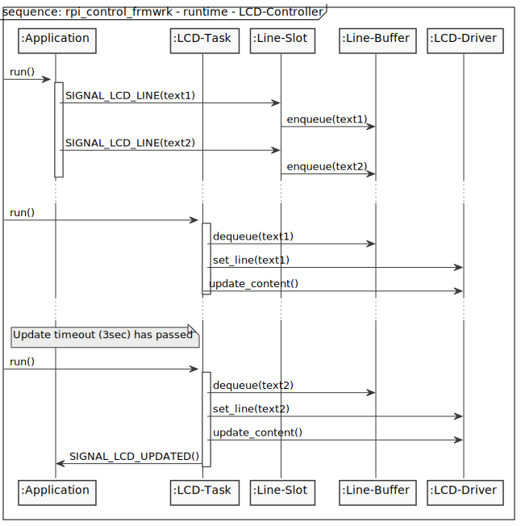

### Location
[frmwrk](../README.md) / [modules](../readme/readme_modules.md) / lcd_controller

# LCD-Controller

## Brief
[[TOP](#location)]

The LCD-controller is used to write text on a connected LCD.
The LCD-Controller implements the LCD-interface.
This interface does not specify a definitve type of LCD.
This means there can be different implementations of the LCD-Controller.

## Integration
[[TOP](#location)]

### Makefile

The LCD-controller is integrated into a project by the Makefile. Depending on the type of LCD to use
the following line is added to the user-interface configuration. There is only support for a LCD with two lines and 16 characters per line available. This also causes the lcd-driver to be integrated into the project.

```Makefile
USER_INTERFACE_CFG += LCD_16X2
```

## Usage

To use the LCD-controller the header file needs to be included. See below

```C
#include "modules/lcd/lcd_interface.h"
```

### Initialization

Befor the LCD can be used it needs to be initialized and enabled. See below.

```C
lcd_init();
lcd_set_enabled(LCD_ENABLE);
```

The LCD-controller can be disabled at runtime. In this case no updates of the LCD can be made anymore.
The LCD-controller needs to be enabled to be used. The LCD is not reseted or re-initialized if the
LCD-controller is enabled once again.

```C
lcd_set_enabled(LCD_DISABLE);
```
### Write Text

Text is transfered to the LCD-controller via the `SIGNAL_LCD_LINE`.
This signal is avaialble by including the header file, see [Usage](#usage).
THe signal does not has a timeout. It can be send as a burst. See example below.

```C
SIGNAL_LCD_LINE_send("This is Text 1");
SIGNAL_LCD_LINE_send("This is Text 2");
SIGNAL_LCD_LINE_send("This is Text 3");
SIGNAL_LCD_LINE_send("This is Text 4");
```

The LCD-Controller
will store up to `5` lines in a internal buffer. These lines will be written to the LCD
on executing the lcd-task. If all currently buffered lines have been written, the LCD-controller sends the 
 `SIGNAL_LCD_UPDATED` signal. You can connect to this signal to get informed of a finished operation.

## Structure
[[TOP](#location)]


## Runtime
[[TOP](#location)]



