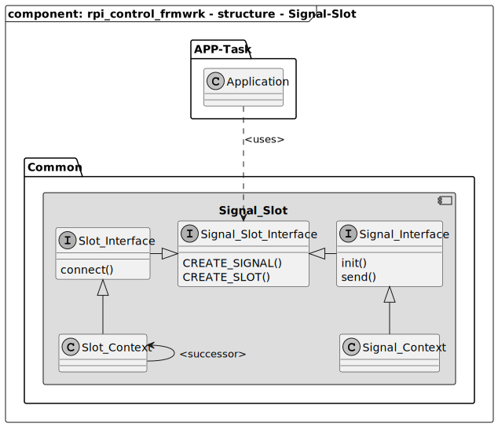

[TOP]: #section "Go to the top of the page"

### Section

Readme | [Changelog](../changelog.md)

### Location
[frmwrk](../README.md) / [kernel](../readme/readme_kernel.md) / signal_slot

# Signal Slot

## Brief
[[TOP]]

The Signal Slot module is sued to transfer data from a application-task to another
without having a dependency between both task.
The basic principle consists of two aspects `sending a signal` and `receiving via a slot`. One task sends the signal the other task proiveds a slot that is connected to that signal. Information is
transfered via arguments.

## Integration
[[TOP]]

### Makefile

The Signal-Slot module is a basic feature and does not need an additional activation
or configuration. It is always available.

## Usage

To use the Signal-Slot module the header file needs to be included. See below

```C++
#include "kernel/interfaces/signal_slot_interface.h"
```

### Signal

A signal is created by the `CREATE_SIGNAL` macro definition.
This statement is placed outside of a function or structure.
See below.

```C++
SIGNAL_SLOT_INTERFACE_CREATE_SIGNAL(MY_SIGNAL)
```

Alternatively a signal can be included via the following macro definition. In this
case the signal is created somewhere else. The include statement can also be placed into a header file to make the signal accessable for multiple files.

```C++
SIGNAL_SLOT_INTERFACE_INCLUDE_SIGNAL(MY_SIGNAL)
```

The signal the must be initialized before it can be used. The following example
shows how to call the initialization routine of the previously created signal.
If the signal was included, the init function shall note be called in the same location as of the included.

```C++
MY_SIGNAL_init();
```

The signal can now be send via its send function. It is possible to provide an argument by its reference. If no argument shall be transmitted `NULL` must be given.
The receiver needs to know the structure of the provided argument. This means
that every signal shall only have one fixed type of argument.

```C++
u8 byte_array[3] = {1,2,3};
MY_SIGNAL_send(byte_array);
```

There is no return value. This is because a signal uses the `fire and forget`
principle. Since a signal can have multiple slots, it does not know which slot causes the error.
And of course a signal cannot know if multiple slots have failed. Furthermore the signal-slot mechanism
is used to seperate different sw components from each other. So, the signal does not know how to handle
a specific return value.

### Slot

A slot is created by the `CREATE_SLOT` macro definition.
This statement is placed outside of a function or structure.
See below.

```C++
SIGNAL_SLOT_INTERFACE_CREATE_SLOT(MY_SIGNAL, MY_SLOT, my_slot_callback)
```

A slot always needs a callback that is executed in case rteh signal is send.
The callback has the following signature.

```C++
void my_slot_callback(const void* p_argument);
```

A slot callback does not has a return value, because a signal is not interested in it.
See [Signal](#signal). It is highly recommended that a slot callback is short as possible.
Because it might be possible that a signal serves a set of multiple ports. This can cause
an unexpected long execution time. Care must be taken about the provided argument.
If a signal does not provide an argument the given refderence then is NULL. It is a good
practice to check for NULL in any case before using the given refernce. It is important to know
that the provided reference is not valid anymore after sending of the signal has finished.
The data shall be copied into a local memory to access the data at a later time.

## Structure
[[TOP]]



## Runtime

