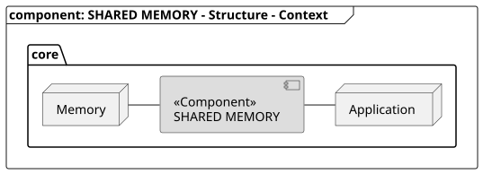
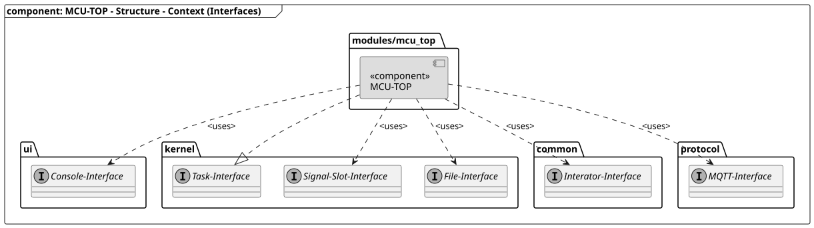
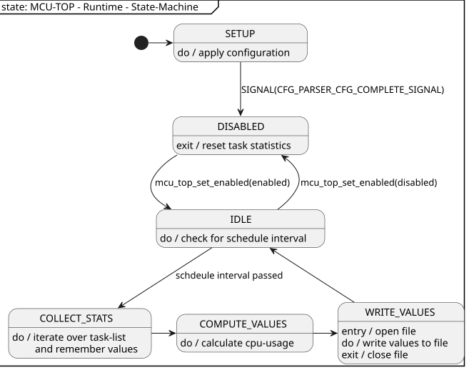

[CFG-File-Parser]: ../../cfg_file_parser/readme/readme_cfg_file_parser.md#section "SW-IRQ based communication system used in the rpi-control firmware"
[CFG_PARSER_CFG_COMPLETE_SIGNAL]: ../../cfg_file_parser/readme/readme_cfg_file_parser.md#signals "Signals send by the CFG-File-Parser after all configuration values have been read."
[MCU-Task-Controller]: ../../../mcu_task_management/readme/readme_task_management.md#section "Component to manage task handling "
[Signal-Slot-Interface]: ../../../../readme/readme_signal_slot.md "SW-IRQ based communication system used in the rpi-control firmware"
[Task-Interface]: ../../../mcu_task_management/readme/readme_task_management.md "Interface to crate task."

[TOP]: #section "Go to the top of the page"

<br>

### Section

Readme | [Changelog](../../../../changelog.md)

<br>

### Location
[frmwrk](../../../../README.md) / [core](../../readme_core.md) / Shared-Memory

<br>

# Shared-Memory

### Content

<details>
<summary> Click to open</summary>


</details>

<br>

## Brief
[[TOP]]

The Shared-Memory module provides an interface to create and manage memory resourcen that are used temporarily
to reduce the overall memory usage. To do so, this module provides several blocks of memory that can be requested on runtime.
After a the memory is not needed anymore, it can be returned to give other modules the possibility to use this memory.
The eliminates the need that every module has to allocate its own memory that is not used all the time.

<br>

## Features
[[TOP]]

- Provide easy to use interface to handle shared memory objects
- dynamically allocate and free memory on runtime
- Functions to add and get standard types (e.g. u8 , u16 and u32)
  
<br>

## Requirements
[[TOP]]

[REQ_SHARED_MEMORY_MEMORY_SIZE]: #req_shared_memory_memory_size "Memory objects shall not occupy more memory as needed."


### REQ_SHARED_MEMORY_MEMORY_SIZE

|                  | |
|------------------|-|
| **Title**:       | Do not occupy more memory as requested. |
| ***Status**:     | IMPLEMENTED |
| **Description**: | The size of a memory object shall not waste memory resourecen. e.g. if an application requests 50 bytes of memory it shall not occupy 300 bytes of memory. |

<br>

## Solution Strategy
[[TOP]]

This section describes how to realize each requirement.

| ID | Concept | Solution |
|----|---------|----------|
| [REQ_SHARED_MEMORY_MEMORY_SIZE] | Provide configuration macros to define the size and number of shared memory sections. On requesting memory the shared-memory management will iterate through the list of all available memory blocks starting wioth the shoretest. The first memory block that has a length above the requests size is used | - |

<br>

## Structure
[[TOP]]

### Context



| Node          | Description                                          |
|---------------|------------------------------------------------------|
| Memory | The Shared Memory module manages the memory that is used by different applications. |
| Application | A application requets memory from the Shared Memory component. |

### Interfaces dependencies



| Node                    | Description                                          |
|-------------------------|------------------------------------------------------|
| [Task-Interface]        | MCU-TOP implements the task-interface to integrate it into the system |

<br>

## Runtime
[[TOP]]

### Concept

The MCU-TOP task is inactive until the schedule interval has passed. If the schedule interval has passed
the MCU-TOP task will collect the current statistics of all available tasks. `WHY??`
It then will calculate the current system load of for every task depending on the current statistics.
The computed values are written to the console or and/or a file on the file system, depending on the current user-configuration.

### State-Machine



| State              | Description |
|--------------------|-------------|
| SETUP              | The user configuertion is applied. This state is left if the signal [CFG_PARSER_CFG_COMPLETE_SIGNAL] arrives |
| DISABLED           | The MCU-Top module is disabled right now. On leaving this state, the task statistics are resetted. |
| IDLE               | Wait until the current schedule interval has passed. Nothing happens in this state. |
| COLLECT_STATS      | The current stats of all task are read. The values are stored for further processing. |
| COMPUTER_VALUES    | The statistics values of the previous state are processed and prepared for displaying / storing. |
| WRITE_VALUES       | The computed values are stored into a file and/or printed on the console.  |

<br>

## Interfaces
[[TOP]]

### Signals

- NONE

### Configuration Macros

The following values can be defined as a macro. E.g. in your project specific `config.h`\

| Configuration Macro               | Default Value | Description                 |
|-----------------------------------|---------------|-----------------------------|
| `MCU_TOP_MAX_NUMBER_OF_TASK`      | 10            | Maximum number of task the MCU-TOP module can handle. |

### Configuration Values

- NONE

<br>

## Integration
[[TOP]]

### Makefile

Add the following statement to your project makefile.
This will define the macro `MCU_TOP_AVAILABLE`.

```make
CORE_CFG += SHARED_MEMORY
```

<br>

## Usage
[[TOP]]

### Initialization

Add the following code block to your initialization routine.
Do not forget to include the header file.

```c
#include "modules/mcu_top/mcu_top.h"
```

```c
#ifdef MCU_TOP_AVAILABLE
{
    mcu_top_init();
}
#endif
```

The following drivers and modules need to be initialized before.
- System
    - Clock
    - RTC
    - [Signal-Slot-Interface]
- [MCU-Task-Controller]
- [CFG-File-Parser]
