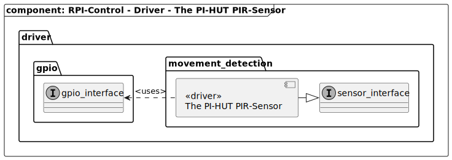

[TOP]: #section "Go to the top of the page"

### Section

Readme | [Changelog](../../../../changelog.md)

### Location
[frmwrk](../../../../README.md) / [driver](../../readme_driver.md) / MOVEMENT-DETECTION

<br>

### Content

<details>
<summary> Click to open</summary>

[The PI-HUT PIR-Sensor](#the-pi-hut-pir-sensor)

</details>

<br>

## MOVEMENT-DETECTION DRIVER

# The PI-HUT PIR-Sensor

### Description

#### PIR knobs

The two dials control the delay (how long before checking for motion again) and sensitivity.

If you look directly at the knobs, with the dome on top, the left knob is used for delay (most leave it as is) and the right one is sensitivity. Turn the right knob counterclockwise to decrease sensitivity.

#### Pin jumper (post-triggering)

The pin jumper can be set to 'H' or 'L' (H is the option closest to the edge). H is the most commonly used setting:

H is the 're-triggering' mode. It sends a signal the entire time something is moving.
L is the 'non-retriggering' mode. This constantly sends signals in and out as long as something is moving (a more erratic option)

### Characteristics

|                |                                  |
|----------------|----------------------------------|
| Input Voltage  | DC 4.5V - 20V                    |
| Static Current | 50uA                             |
| Trigger-Signal | high-level on movement-detection |
| Angle          | 110°                             |
| Distance       | 7 meter                          |

### Structure



### Integration

#### Makefile

```make
DRIVER_MODULE_CFG += THE_PI_HUT_PIR
```

#### GPIO-Alias

```c
// Gpio-interface wiht definition to create a gpio-pin and a gpio-alias
#include "driver/gpio/gpio_interface.h"

// Build a gpio as input with ilde low level
BUILD_GPIO ( GPIO_NAME, GPIO_PORT_A, GPIO_PIN_0, GPIO_INPUT | GPIO_IDLE_LOW )

// The PI_HUT Pir sensor driver uses this pin
GPIO_ALIAS( PIR_SENSOR , GPIO_NAME)
```
