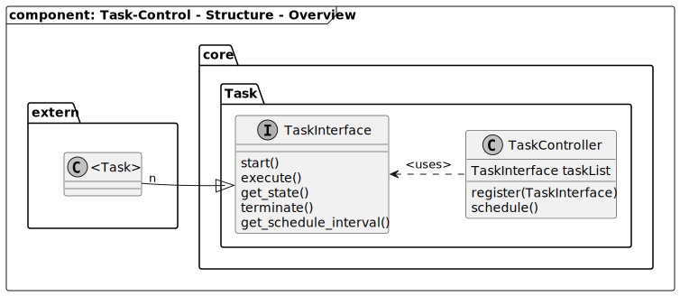

[TOP]: #section "Go to the top of the page"

### Section

Readme | [Changelog](../../../changelog.md)

### Location
[frmwrk](../../../README.md) / [kernel](../../../readme/readme_kernel.md#section) / Task-Control

<br>
<br>

### Content

<details>
<summary> Click to open</summary>

[Brief](#brief)\
[Features](#features)\
[Integration](#integration)\
[Usage](#usage)\
&nbsp;&nbsp;&nbsp;&nbsp;[Initialization](#initialization)\
&nbsp;&nbsp;&nbsp;&nbsp;[Write text](#write-text)\
[Structure](#structure)\
[Runtime](#runtime)

</details>

<br>
<br>

# Task Management

## Brief
[[TOP]]

## Features
[[TOP]]


## Requirements
[[TOP]]

[REQ_TASK_MGMNT_TASK_DIAGNOSTIC]: #Requirements "The status of all task can be accessed for diagnotic"


| ID | Title | Description | *Status |
|----|-------|-------------|--------|
| [REQ_TASK_MGMNT_TASK_DIAGNOSTIC] | Get diagnostic of all task's | Diagnostic information of all available task's can be accessed in read only mode. The folowing information shall be provided as a minimum: <ul><li>The task's id</li><li>the overall runtime of a task</li><li>The overall system runtime</li></ul> | DEFINED |

****Status***: the following states apply on the status field
- **DEFINED** - The requirement has been defined only.
- **CONCEPT** - There is a concept available how to realize the requirement
- **IMPLEMENTED** - The requirement has been implemented. There is a test-system available
- **VERIFIED** - The funcitonality of the reuirement has been verified. E.g. there is a unittest available and the feature was tested over a long period on the test-system.

<br>

## Solution Strategy
[[TOP]]

This section describes how to realize each requirement.

| ID | Concept | Solution |
|----|---------|----------|
| [REQ_TASK_MGMNT_TASK_DIAGNOSTIC] | The number of task depends on the system configuration. The task are accessed by a iteration interface. This interface provides a read-only access. This interface does not include a connection to any other interface or communication system. The runtime of a task is stored in its context and is updated on a task change. | - |

<br>

## Integration
[[TOP]]

The task managemnt is part of the core system. Its functionality is always available.

## Usage
[[TOP]]

To access the functions of the task amanagement the header file needs to be included. See below

```C
#include "mcu_task_interface.h"
```

### Initialization


### Create Task


## Structure
[[TOP]]

### Overview



## Runtime
[[TOP]]


