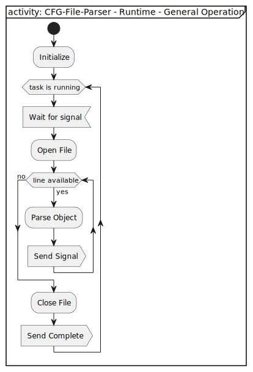

[TOP]: #section "Go to the top of the page"

[Signal-Slot-Interface]: ../../../../readme/readme_signal_slot.md "SW-IRQ based communication system used in the rpi-control firmware"

<br>

### Section

Readme | [Changelog](../../../../changelog.md)

<br>

### Location
[frmwrk](../../../../README.md) / [modules](../../readme_modules.md) / CFG-FILE-PARSER

<br>

# CFG-FILE-PARSER

<br>

### Content

<details>
<summary> Click to open</summary>

[Brief](#brief)\
[Features](#features)\
[Requirements](#requirements)\
[Solution Strategy](#solution-strategy)\
[Structure](#structure)\
&nbsp;&nbsp;&nbsp;&nbsp;[Context](#context)\
[Runtime](#runtime)\
&nbsp;&nbsp;&nbsp;&nbsp;[General Operation](#general-operation)\
&nbsp;&nbsp;&nbsp;&nbsp;[State-Machine](#state-machine)\
[Interface](#interface)\
&nbsp;&nbsp;&nbsp;&nbsp;[Data types](#data-types)\
&nbsp;&nbsp;&nbsp;&nbsp;&nbsp;&nbsp;&nbsp;&nbsp;[CFG-Object](#cfg-object)\
&nbsp;&nbsp;&nbsp;&nbsp;[Signals](#signals)\
&nbsp;&nbsp;&nbsp;&nbsp;[Configuration Macros](#configuration-macros)\
[Integration](#integration)\
&nbsp;&nbsp;&nbsp;&nbsp;[Makefile](#makefile)\
&nbsp;&nbsp;&nbsp;&nbsp;[Initialization](#initialization)\
&nbsp;&nbsp;&nbsp;&nbsp;[Dependencies](#dependencies)\
[Usage](#usage)\
&nbsp;&nbsp;&nbsp;&nbsp;[Slots](#slots)

</details>

<br>

## Brief
[[TOP]]

The CFG-FILE-PARSER module i supposed to load several configuraiton values from a file and publish them via the signal-slot-interface.
Every module that is conencted to the signals of the CFG-FILE-PARSER can applay the configuration values of it's need.

<br>

## Features
[[TOP]]

... comming soon ...

<br>

## Requirements
[[TOP]]

[REQ_MOVEMENT_01_LOAD_CFG_VALUES_FROM_FILE]: #Requirements "Requirement to load cfg-values from a file"
[REQ_MOVEMENT_02_SUPPORT_COMMENTS_AND_EMPTY_LINES]: #Requirements "Requirement to ignore empty and comment lines in a file"
[REQ_MOVEMENT_03_SIGNAL_FINISHED_CFG_LOAD]: #Requirements "Requirement to signal finished operation"
[REQ_MOVEMENT_04_LOAD_CONFIGURATION_ON_RUNTIME]: #Requirements "Requirement to load another file at runtime."
[REQ_MOVEMENT_05_PUBLISH_CFG_VALUES]: #Requirements "Requirement to publish the cofniguration values."

| ID | Title | Description | *Status |
|----|-------|-------------|--------|
| [REQ_MOVEMENT_01_LOAD_CFG_VALUES_FROM_FILE] | Load cfg values | The CFG-FILE-PARSER can open a file for reading. The content is read and cfg-values are paresed. | IMPLEMENTED |
| [REQ_MOVEMENT_02_SUPPORT_COMMENTS_AND_EMPTY_LINES] | Ignore empty lines  | Empty and comment lines are ignored. | IMPLEMENTED |
| [REQ_MOVEMENT_03_SIGNAL_FINISHED_CFG_LOAD] | Signal finished operation | After a file has been read completely the CFG-FILE-PARSER sends a signal to inform all connected modules about end of loading cfg-values. | IMPLEMENTED |
| [REQ_MOVEMENT_04_LOAD_CONFIGURATION_ON_RUNTIME] | Load cfg at runtime | The CFG-FILE-PARSER can load some several other configuration values from different files at any time. | IMPLEMENTED |
| [REQ_MOVEMENT_05_PUBLISH_CFG_VALUES] | Publish cfg values | Cfg values from the current file are published sperately to all connected modules. | IMPLEMENTED |

****Status***: the following states apply on the status field
- **DEFINED** - The requirement has been defined only.
- **CONCEPT** - There is a concept available how to realize the requirement
- **IMPLEMENTED** - The requirement has been implemented. There is a test-system available
- **VERIFIED** - The funcitonality of the reuirement has been verified. E.g. there is a unittest available and the feature was tested over a long period on the test-system.

<br>

## Solution Strategy
[[TOP]]

This section describes how to realize each requirement.

| ID | Concept | Solution |
|----|---------|----------|
| [REQ_MOVEMENT_01_LOAD_CFG_VALUES_FROM_FILE] | The CFG-FILE-PARSER uses the File-Interface to access files | - |
| [REQ_MOVEMENT_02_SUPPORT_COMMENTS_AND_EMPTY_LINES] | on processing every line is read seperately. Whitespaces in front and at the end are removed. If the length of a line is zero it is empty and will be ignored. If a lines beginns with the comment-marker this line is also ignored. | - |
| [REQ_MOVEMENT_03_SIGNAL_FINISHED_CFG_LOAD] | The [Signal-Slot-Interface] is used to generate system-signals | - |
| [REQ_MOVEMENT_04_LOAD_CONFIGURATION_ON_RUNTIME] | The [Signal-Slot-Interface] is used to generate system-signals | - |
| [REQ_MOVEMENT_05_PUBLISH_CFG_VALUES] | The [Signal-Slot-Interface] is used to generate system-signals | - |

<br>

## Structure
[[TOP]]

<br>

### Context


<br>

## Runtime
[[TOP]]

<br>

### General Operation

The diagram below shows the general operation of the CFG-File-Parser.
After the CFG-File-Parser has been initialized it runs in its task as long task are active.
The first step is waiting for the path to the cfg-file that shall be loaded. The path is send as a Signal.
After the signal has received the file is loaded and read line wise.
Every line is expected to contain only one configuration object, e.g. `<key>=<value>`
Every parsed cfg-object is send as arguemnt via a signal to all connected receivers.
After the file has been read completely the receivers are informed that there are no more cfg-values available.



<br>

### State-Machine


| State              | Description |
|--------------------|-------------|
| IDLE               | This state is entered after system startup. The CFG-FILE-PARSER waits for the first configuration file. If no file is given and the timeout is over this state is also left. |
| OPEN_FILE          | Opens the given configuration file. The CFG-FILE-PARSER checks if the file can be accessed. |
| LOAD_CONFIGURATION | Reads the configuration file line by line. empty lines and comment lines are ignored. Each cofniguration pair (key+value) is parsed and is published seperately. |
| SIGNAL_COMPLETE    | In this state the CFG-FILE-PARSER informs all connected modules that no more configuration values are available. |
| WAIT_FOR_FILE      | In this state the CFG-FILE-PARSER waits for another configuration file.  |

<br>

## Interface
[[TOP]]

### Data Types

Data type that are availalbe via the interface of the CFG-File-Parser. See `cfg_file_parser.h`

#### CFG Object

| Field | Type   | Description |
|-------|--------|-------------|
| `key`   | Character array | Name of the configuration value as character array with temrination-character at the end. Maximum size is `CFG_FILE_PARSER_MAX_LENGTH_CFG_KEY` (See [Configuration Macros](#configuration-macros)) |
| `value` | Character array | Value of the configuration value as character array with temrination-character at the end. Maximum size is `CFG_FILE_PARSER_MAX_LENGTH_CFG_VALUE` (See [Configuration Macros](#configuration-macros)) |

<br>

### Signals

| Signal-Name                        | Direction | Arguments    | Description |
|------------------------------------|-----------|--------------|-------------|
| `CLI_CONFIGURATION_SIGNAL`         | RECEIVE   | path to file | Tells the CFG-FILE-PRASER which configuration file to load. Can be send on runtime as well. |
| `CFG_PARSER_NEW_CFG_OBJECT_SIGNAL` | SEND      | Cfg-Object   | No more configuration values available from the current file. |
| `CFG_PARSER_CFG_COMPLETE_SIGNAL`   | SEND      | CFG-OBJECT   | The current cfg-object that was read from the current configuration file. |

<br>

### Configuration Macros

The following values can be defined as a macro. E.g. in your project specific `config.h`\
See [modules/cfg_file_parser/cfg_file_parser.h](../../../modules/cfg_file_parser/cfg_file_parser.h)

| Configuration Macro                            | Default Value | Description                 |
|------------------------------------------------|---------------|-----------------------------|
| `CFG_FILE_PARSER_MAX_LENGTH_CFG_KEY`           | 255 | Maximum number of characters that can be used for a configuration key. The value includes the termination character. The useable length of key is `CFG_FILE_PARSER_MAX_LENGTH_CFG_KEY - 1` |
| `CFG_FILE_PARSER_MAX_LENGTH_CFG_VALUE`         | 255 | Maximum number of characters that can be used for a configuration value. The value includes the termination character. The useable length of key is `CFG_FILE_PARSER_MAX_LENGTH_CFG_VALUE - 1` |
| `CFG_FILE_PARSER_MAX_LENGTH_PATH`              | 255 | Maximum number of characters that can be used for a file path. |
| `CFG_FILE_PARSER_MAX_LENGTH_CFG_VALUE`         | 255 | Maximum number of characters that can be used for a configuration value. The value includes the termination character. The useable length of key is `CFG_FILE_PARSER_MAX_LENGTH_CFG_VALUE - 1` |
| `CFG_FILE_PARSER_MAX_LINE_LENGTH`              | 512 | Maximum number of characters that are exected in a single line. You can redefine this value inside your `config.h.` The default value is `CFG_FILE_PARSER_MAX_LENGTH_PATH + CFG_FILE_PARSER_MAX_LENGTH_CFG_VALUE + 2`. ( +1 for CFG_FILE_PARSER_KEY_VALUE_SPLITTER / +1 for newline character |
| `CFG_FILE_PARSER_KEY_VALUE_SPLITTER`           | `=` | Key / Value seperator to be used. |
| `CFG_FILE_PARSER_COMMENT_CHARACTER`            | `#` | Character that indicates a comment line which is ignored. |
| `CFG_FILE_PARSER_WAIT_FOR_CFG_FILE_TIMEOUT_MS` | 255 | Timeout in milliseconds after which the CFG_PARSER_CFG_COMPLETE_SIGNAL is send after system start in case no cfg-file was given. |

<br>

## Integration
[[TOP]]

<br>

### Makefile

Add the following statement to your project makefile.
This will define the macro `CFG_FILE_PARSER_AVAILABLE`.

```makefile
USER_INTERFACE_CFG += CFG_FILE_PARSER
```
<br>

### Initialization

Include the header file of the cfg-file parser and 
add the call to the initialization function initialization routine.
Example:
```c
#include "cfg_file_parser.h"

...

void initialization(void) {

    ...

    #ifdef CFG_FILE_PARSER_AVAILABLE
    {
        cfg_file_parser_init();
    }
    #endif

    ...
}

```

### Dependencies

The following drivers and modules need to be initialized before.
- System
    - Clock
    - RTC
    - GPIO 
    - Signal-Slot
- Task

<br>

## Usage
[[TOP]]

<br>

### Slots

To receive new cfg-object you need to create slot and connect it to `CFG_PARSER_NEW_CFG_OBJECT_SIGNAL`
To get informed that preocessing the cfg file has finished you need to create a slot and connect it to `CFG_PARSER_CFG_COMPLETE_SIGNAL`
The example below shows how to use both signals.

<br>

- Include header files

```c
#include "signal_slot_itnerface"
#include "cfg_file_parser.h"
```

- Create slot and callback

```c

static void new_cfg_object_CALLBACK(const void* p_argument) {
    ...
}

SIGNAL_SLOT_INTERFACE_CREATE_SLOT(
    CFG_PARSER_NEW_CFG_OBJECT_SIGNAL,
    NEW_CFG_OBJECT_SLOT,
    new_cfg_object_CALLBACK
)

static void cfg_complete_CALLBACK(const void* p_argument) {
    ...
}

SIGNAL_SLOT_INTERFACE_CREATE_SLOT(
    CFG_PARSER_CFG_COMPLETE_SIGNAL,
    CFG_COMPLETE_SLOT,
    cfg_complete_CALLBACK
)
```

- Connect slot at startup

```c
void main() {

    // Initialization
    ...

    // CFG-File-Parser needs to be initialized at this point
    NEW_CFG_OBJECT_SLOT_connect();
    CFG_COMPLETE_SLOT_connect();

    ...

    // Main loop
    while(1) {
        ...
    }
}
```
