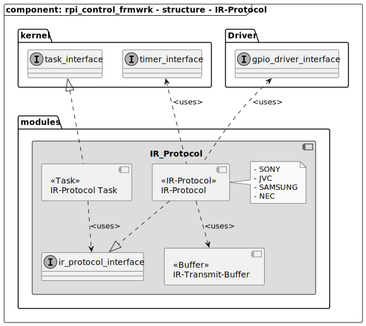
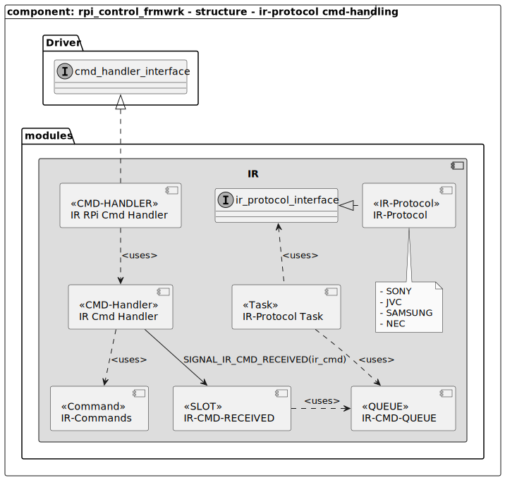
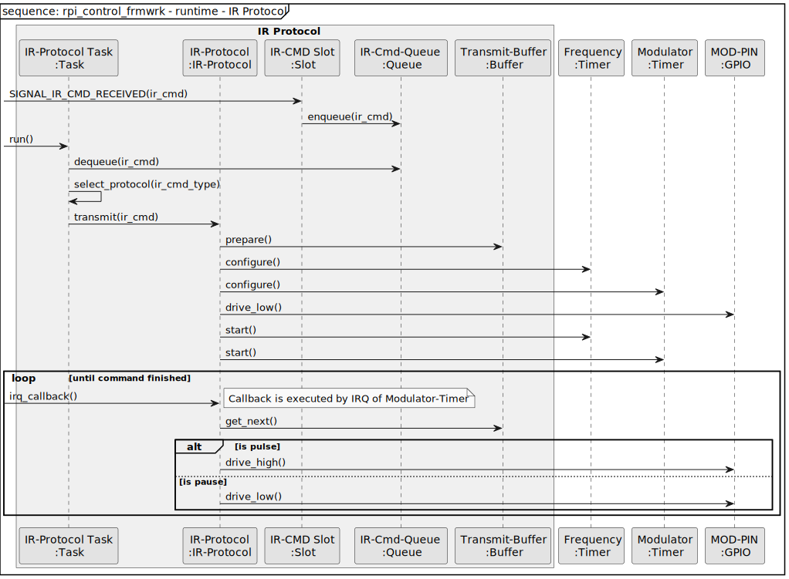

[TOP]: #section "Go to the top of the page"

### Section

Readme | [Changelog](../../../../changelog.md)

### Location
[frmwrk](../../../../README.md) / [modules](../../readme_modules.md) / IR

# IR

## Brief
[[TOP]]


## Integration
[[TOP]]

### Makefile


```Makefile
USER_INTERFACE_CFG += LCD_16X2
```

## Usage

To use the LCD-controller the header file needs to be included. See below

```C
#include "modules/ir/ir_protocol_task.h"
```

### Initialization

Befor the LCD can be used it needs to be initialized and enabled. See below.

```C
ir_protocol_init();
```

## Add Protocol

## Structure
[[TOP]]

### IR Protocol



### Command Handling



## Runtime
[[TOP]]

