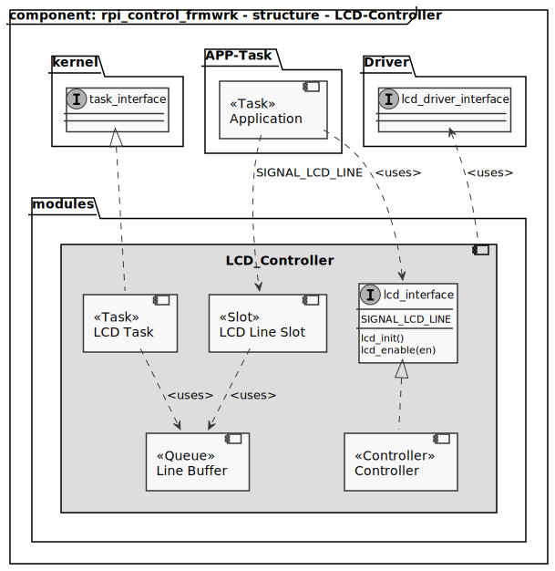
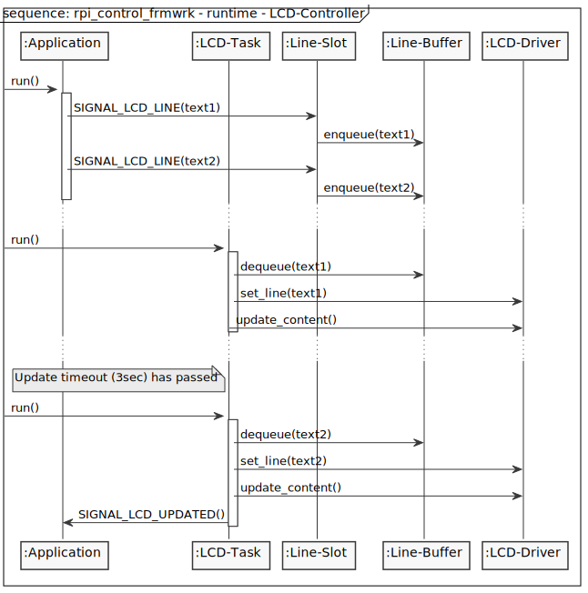

[TOP]: #section "Go to the top of the page"

### Section

Readme | [Changelog](../../../../changelog.md)

### Location
[frmwrk](../../../../README.md) / [modules](../../readme_modules.md) / KEYPAD

# LCD

## Brief
[[TOP]]

Interface to handle a keypad.

## Integration
[[TOP]]

### Makefile

The KEYPAD-controller is integrated into a project by the Makefile. Depending on the type of KEYPAD to use
the following line is added to the MODULE configuration. There is only support for a KEYAD with 7 pins. Three COLUMN pins are used as
outputs to set a high level for detection. CUrrently pressed keys are read via the four ROW pins.

```Makefile
USER_INTERFACE_CFG += KEYPAD_3X4
```

## Usage

To use the keypad-controller the header file needs to be included. See below

```C
#include "modules/keypad/keypad_interface.h"
```

### Initialization

Befor the LCD can be used it needs to be initialized and enabled. See below.

```C
keypad_init();
```

### Connect Key Slots

Keys are handled via Signals. If a key is pressed the 'PRESSED' signal of this key is send.
If more than one key is pressed at a time. A seperate signal for every pressed key is send.
To handle a key a slot mus be connected to its pressed-signal. The following tyble gives an
overview about the available signals.

| Signal        | Description                  |
|---------------|------------------------------|
| KEY_0_PRESSED_SIGNAL | Key 0 is currently pressed   |
| KEY_1_PRESSED_SIGNAL | Key 1 is currently pressed   |
| KEY_2_PRESSED_SIGNAL | Key 2 is currently pressed   |
| KEY_3_PRESSED_SIGNAL | Key 3 is currently pressed   |
| KEY_4_PRESSED_SIGNAL | Key 4 is currently pressed   |
| KEY_5_PRESSED_SIGNAL | Key 5 is currently pressed   |
| KEY_6_PRESSED_SIGNAL | Key 6 is currently pressed   |
| KEY_7_PRESSED_SIGNAL | Key 7 is currently pressed   |
| KEY_8_PRESSED_SIGNAL | Key 8 is currently pressed   |
| KEY_9_PRESSED_SIGNAL | Key 9 is currently pressed   |
| KEY_SPECIAL_1_PRESSED_SIGNAL | Special Key 1 is currently pressed   |
| KEY_SPECIAL_2_PRESSED_SIGNAL | Special Key 2 is currently pressed   |

The following example shows how to create a handler for KEY_0.

```C
void MY_KEY_0_PRESSED_SIGNAL_HANDLER(void) {
    // do something
}

...

SIGNAL_SLOT_INTERFACE_CREATE_SLOT(KEY_0_PRESSED_SIGNAL, MY_KES_0_PRESSED_SIGNAL_SLOT, MY_KEY_0_PRESSED_SIGNAL_HANDLER)
```

## Scheduling

## Structure
[[TOP]]



## Runtime
[[TOP]]



