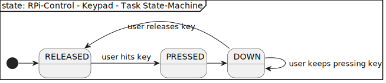

[TOP]: #section "Go to the top of the page"

[Signal-Slot-Interface]: ../../../../readme/readme_signal_slot.md#section "SW-IRQ based communication system used in the rpi-control firmware"

[REQ_KEYPAD_01_USE_SYSTEM_MSG_BUS]: #REQ_KEYPAD_01_USE_SYSTEM_MSG_BUS "Requirement that the current system-wide message bus is used for sending signals and information"
[REQ_KEYPAD_02_KEY_STATES]: #REQ_KEYPAD_02_KEY_STATES "Requirement that a key can have one of three states RELEASED / PRESSED / RELEASED"
[REQ_KEYPAD_03_STATE_EVENTS]: #REQ_KEYPAD_03_STATE_EVENTS "Requirement that there is a event generate in case a key has changed its state."
[REQ_KEYPAD_04_KEYPAD_INDEPENDENCE]: #REQ_KEYPAD_04_KEYPAD_INDEPENDENCE "Requirement that keypad controller does not depend on a specific type of keypad-hw"

### Section

Readme | [Changelog](../../../../changelog.md)

### Location
[frmwrk](../../../../README.md) / [modules](../../readme_modules.md) / KEYPAD

<br>

### Content

<details>
<summary> Click to open</summary>

[Brief](#brief)\
[Features](#features)\
[Solution Strategy](#solution-strategy)\
[Structure](#structure)\
&nbsp;&nbsp;&nbsp;&nbsp;[Context](#context)\
[Runtime](#runtime)\
&nbsp;&nbsp;&nbsp;&nbsp;[State-Machine](#state-machine)\
[Interface](#interface)\
&nbsp;&nbsp;&nbsp;&nbsp;[Signals](#signals)\
&nbsp;&nbsp;&nbsp;&nbsp;[Configuration Macros](#configuration-macros)\
[Integration](#integration)\
&nbsp;&nbsp;&nbsp;&nbsp;[Makefile](#makefile)\
[Usage](#usage)\
&nbsp;&nbsp;&nbsp;&nbsp;[Initialization](#initialization)

</details>

<br>

# Keypad

## Brief
[[TOP]]

Interface to handle a keypad.

## Features
[[TOP]]

... comming soon ...

## Requirements
[[TOP]]

| ID | Title | Description | *Status |
|----|-------|-------------|---------|
| [REQ_KEYPAD_01_USE_SYSTEM_MSG_BUS] | Use system msg-bus | Keyevents shall be published using the system wide message bus. | DEFINED |
| [REQ_KEYPAD_02_KEY_STATES] | A key can have have different states | Every key can have one of the following states. A key can always be in only one state at a time.<ul><li>RELEASED - key is not used at this moment</li><li>PRESSED - the key was just pressed, this state is left automatically</li><li>DOWN - The key is hold down by the user.</li></ul> | DEFINED |
| [REQ_KEYPAD_03_STATE_EVENTS] | Generate key state events. | In case the state of a key is changed (see the list below) a event is generated transmitted via the system msg-bus. The events are generated for each key individually. <br><ul><li>RELEASED -> PRESSED</li><li>PRESSED -> DOWN</li><li>DOWN -> RELEASED</li></ul> | DEFINED |
| [REQ_KEYPAD_04_KEYPAD_INDEPENDENCE] | Independence of Keypad-HW | The keypad controller doesn not depends on a specific type of keypad. The HW can be changed without changing the keypad-controller | DEFINED |

****Status***: the following states apply on the status field
- **DEFINED** - The requirement has been defined only.
- **CONCEPT** - There is a concept available how to realize the requirement
- **IMPLEMENTED** - The requirement has been implemented. There is a test-system available
- **VERIFIED** - The funcitonality of the reuirement has been verified. E.g. there is a unittest available and the feature was tested over a long period on the test-system.

## Solution Strategy
[[TOP]]

This section describes how to realize each requirement.

| ID | Concept | Solution |
|----|---------|-------------|
| [REQ_KEYPAD_01_USE_SYSTEM_MSG_BUS] | The [Signal-Slot-Interface] is used to gneereate system-signals | See section [Interface/Signals](#signals) |
| [REQ_KEYPAD_02_KEY_STATES] | - | - |
| [REQ_KEYPAD_03_STATE_EVENTS] | - | - |
| [REQ_KEYPAD_04_KEYPAD_INDEPENDENCE] | - | - |

## Structure
[[TOP]]

### Context


## Runtime
[[TOP]]

### State-Machine

#### Controller States


| State      | Description |
|------------|-------------|
| IDLE       | - |
| GET_KEYS   | - |

#### Key States



| State      | Description |
|------------|-------------|
| RELEASED   | The key is currently not activated in any way |
| PRESSED    | The key was just pressed by the user, This state is left automatically, even if the user continous pressing the key |
| DOWN       | As long a key is pressed by the user, the key will remain in this state. |

## Interface
[[TOP]]

### Signals

| Signal-Name           | Direction | Arguments | Description |
|-----------------------|-----------|-----------|-------------|
| `KEY_0_PRESSED`       | SEND      | none      | Is send if KEY_0 changes state from RELEASED to PRESSED |
| `KEY_0_DOWN`          | SEND      | none      | Is send as long KEY_0 is pressed by the user |
| `KEY_0_RELEASED`      | SEND      | none      | Is send if KEY_0 changes state from DOWN to RELEASED |
| `KEY_1_PRESSED`       | SEND      | none      | Is send if KEY_1 changes state from RELEASED to PRESSED |
| `KEY_1_DOWN`          | SEND      | none      | Is send as long KEY_1 is pressed by the user |
| `KEY_1_RELEASED`      | SEND      | none      | Is send if KEY_1 changes state from DOWN to RELEASED |
| `KEY_2_PRESSED`       | SEND      | none      | Is send if KEY_2 changes state from RELEASED to PRESSED |
| `KEY_2_DOWN`          | SEND      | none      | Is send as long KEY_2 is pressed by the user |
| `KEY_2_RELEASED`      | SEND      | none      | Is send if KEY_2 changes state from DOWN to RELEASED |
| `KEY_3_PRESSED`       | SEND      | none      | Is send if KEY_3 changes state from RELEASED to PRESSED |
| `KEY_3_DOWN`          | SEND      | none      | Is send as long KEY_3 is pressed by the user |
| `KEY_3_RELEASED`      | SEND      | none      | Is send if KEY_3 changes state from DOWN to RELEASED |
| `KEY_4_PRESSED`       | SEND      | none      | Is send if KEY_4 changes state from RELEASED to PRESSED |
| `KEY_4_DOWN`          | SEND      | none      | Is send as long KEY_4 is pressed by the user |
| `KEY_4_RELEASED`      | SEND      | none      | Is send if KEY_4 changes state from DOWN to RELEASED |
| `KEY_5_PRESSED`       | SEND      | none      | Is send if KEY_5 changes state from RELEASED to PRESSED |
| `KEY_5_DOWN`          | SEND      | none      | Is send as long KEY_5 is pressed by the user |
| `KEY_5_RELEASED`      | SEND      | none      | Is send if KEY_5 changes state from DOWN to RELEASED |
| `KEY_6_PRESSED`       | SEND      | none      | Is send if KEY_6 changes state from RELEASED to PRESSED |
| `KEY_6_DOWN`          | SEND      | none      | Is send as long KEY_6 is pressed by the user |
| `KEY_6_RELEASED`      | SEND      | none      | Is send if KEY_6 changes state from DOWN to RELEASED |
| `KEY_7_PRESSED`       | SEND      | none      | Is send if KEY_7 changes state from RELEASED to PRESSED |
| `KEY_7_DOWN`          | SEND      | none      | Is send as long KEY_7 is pressed by the user |
| `KEY_7_RELEASED`      | SEND      | none      | Is send if KEY_7 changes state from DOWN to RELEASED |
| `KEY_8_PRESSED`       | SEND      | none      | Is send if KEY_8 changes state from RELEASED to PRESSED |
| `KEY_8_DOWN`          | SEND      | none      | Is send as long KEY_8 is pressed by the user |
| `KEY_8_RELEASED`      | SEND      | none      | Is send if KEY_8 changes state from DOWN to RELEASED |
| `KEY_9_PRESSED`       | SEND      | none      | Is send if KEY_9 changes state from RELEASED to PRESSED |
| `KEY_9_DOWN`          | SEND      | none      | Is send ias longf KEY_9 is pressed by the user |
| `KEY_9_RELEASED`      | SEND      | none      | Is send if KEY_9 changes state from DOWN to RELEASED |
| `KEY_SPECIAL_1_PRESSED`       | SEND      | none      | Is send if KEY_SPECIAL_1 changes state from RELEASED to PRESSED |
| `KEY_SPECIAL_1_DOWN`          | SEND      | none      | Is send as long KEY_SPECIAL_1 is pressed by the user |
| `KEY_SPECIAL_1_RELEASED`      | SEND      | none      | Is send if KEY_SPECIAL_1 changes state from DOWN to RELEASED |
| `KEY_SPECIAL_2_PRESSED`       | SEND      | none      | Is send if KEY_SPECIAL_2 changes state from RELEASED to PRESSED |
| `KEY_SPECIAL_2_DOWN`          | SEND      | none      | Is send as long KEY_SPECIAL_2 is pressed by the user |
| `KEY_SPECIAL_2_RELEASED`      | SEND      | none      | Is send if KEY_SPECIAL_2 changes state from DOWN to RELEASED |

### Configuration Macros

The following values can be defined as a macro. E.g. in your project specific `config.h`\
See [modules/movement_detection/movement_detection_controller.h](../../../modules/movement_detection/movement_detection_controller.h)

| Configuration Macro                            | Default Value | Description                 |
|------------------------------------------------|---------------|-----------------------------|
| `KEYPAD_CONTROLLER_3X4_SCHEDULE_INTERVAL_MS`   | 50            | Interval in milliseconds at which the keypad controller task is scheduled. |
| `KEYPAD_CONTROLLER_3X4_PAUSE_TIME_MS`          | 100           | Time in milliseconds a key is ig |

## Integration
[[TOP]]

### Makefile

The KEYPAD-controller is integrated into a project by the Makefile. Depending on the type of KEYPAD to use
the following line is added to the MODULE configuration. There is only support for a KEYAD with 7 pins. Three COLUMN pins are used as
outputs to set a high level for detection. CUrrently pressed keys are read via the four ROW pins.

```Makefile
USER_INTERFACE_CFG += KEYPAD_3X4
```

## Usage

To use the keypad-controller the header file needs to be included. See below

```C
#include "modules/keypad/keypad_interface.h"
```

### Initialization

Befor the LCD can be used it needs to be initialized and enabled. See below.

```C
keypad_init();
```

### Connect Key Slots

Keys are handled via Signals. If a key is pressed the 'PRESSED' signal of this key is send.
If more than one key is pressed at a time. A seperate signal for every pressed key is send.
To handle a key a slot mus be connected to its pressed-signal.
See [Interface/Signals](#signals) for a list of all available signals

The following example shows how to create a handler for KEY_0.

```C
void MY_KEY_0_PRESSED_SIGNAL_HANDLER(void) {
    // do something
}

...

SIGNAL_SLOT_INTERFACE_CREATE_SLOT(KEY_0_PRESSED_SIGNAL, MY_KES_0_PRESSED_SIGNAL_SLOT, MY_KEY_0_PRESSED_SIGNAL_HANDLER)
```