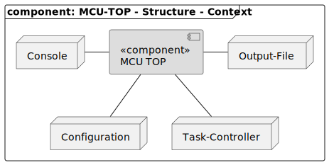
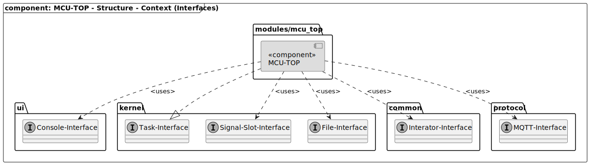
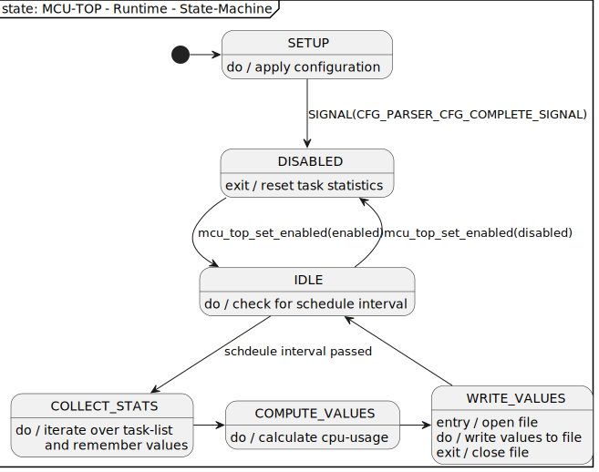

[CFG-File-Parser]: ../../cfg_file_parser/readme/readme_cfg_file_parser.md#section "SW-IRQ based communication system used in the rpi-control firmware"
[CFG_PARSER_CFG_COMPLETE_SIGNAL]: ../../cfg_file_parser/readme/readme_cfg_file_parser.md#signals "Signals send by the CFG-File-Parser after all configuration values have been read."
[MCU-Task-Controller]: ../../../mcu_task_management/readme/readme_task_management.md#section "Component to manage task handling "
[Signal-Slot-Interface]: ../../../../readme/readme_signal_slot.md "SW-IRQ based communication system used in the rpi-control firmware"
[Task-Interface]: ../../../mcu_task_management/readme/readme_task_management.md "Interface to crate task."

[TOP]: #section "Go to the top of the page"

<br>

### Section

Readme | [Changelog](../../../../changelog.md)

<br>

### Location
[frmwrk](../../../../README.md) / [modules](../../readme_modules.md) / MCU-TOP

<br>

# MCU-TOP

<br>

### Content

<details>
<summary> Click to open</summary>

- [MCU-TOP](#mcu-top)
    - [Content](#content)
  - [Brief](#brief)
  - [Features](#features)
  - [Requirements](#requirements)
    - [REQ\_MCU\_TOP\_ITERATE\_TASK\_LIST](#req_mcu_top_iterate_task_list)
    - [REQ\_MCU\_TOP\_SCHEDULE\_INTERVAL](#req_mcu_top_schedule_interval)
    - [REQ\_MCU\_TOP\_PRINT\_CPU\_USAGE](#req_mcu_top_print_cpu_usage)
    - [REQ\_MCU\_TOP\_WRITE\_INTO\_FILE](#req_mcu_top_write_into_file)
    - [REQ\_MCU\_TOP\_PRINT\_ON\_CONSOLE](#req_mcu_top_print_on_console)
    - [REQ\_MCU\_TOP\_REMEMBER\_LAST\_RESULTS](#req_mcu_top_remember_last_results)
    - [REQ\_MCU\_TOP\_CONFIGUREABLE\_FILE\_SIZE](#req_mcu_top_configureable_file_size)
      - [\*Status](#status)
  - [Solution Strategy](#solution-strategy)
  - [Structure](#structure)
    - [Context](#context)
    - [Interfaces dependencies](#interfaces-dependencies)
  - [Runtime](#runtime)
    - [Concept](#concept)
    - [State-Machine](#state-machine)
  - [Interfaces](#interfaces)
    - [Signals](#signals)
    - [Configuration Macros](#configuration-macros)
    - [Configuration Values](#configuration-values)
    - [MQTT-Output](#mqtt-output)
    - [Console-Output](#console-output)
  - [Integration](#integration)
    - [Makefile](#makefile)
  - [Usage](#usage)
    - [Initialization](#initialization)


</details>

<br>

## Brief
[[TOP]]

MCU-TOP gives an overview about the task of the current system configuration on runtime.
it can lsit all available task and their statistics, e.g. their cpu-runtime.
MCU-TOP also generates the current cpu usage in percent of all available tasks.

<br>

## Features
[[TOP]]

- Provide statistics about all task of the current system configuration
- Provide information about the cpu-usage of all tasks.
- Configurable schedule interval
- Configureable file where to write statistics

<br>

## Requirements
[[TOP]]

<br>

[REQ_MCU_TOP_ITERATE_TASK_LIST]: #req_mcu_top_iterate_task_list "MCU-TOP shall iterate over all available task of the system"
[REQ_MCU_TOP_PRINT_CPU_USAGE]: #REQ_MCU_TOP_PRINT_CPU_USAGE "MCU-TOP provides information about the cpu-usage of a task"
[REQ_MCU_TOP_WRITE_INTO_FILE]: #REQ_MCU_TOP_WRITE_INTO_FILE "MCU-TOP can write the task statistics to a user defined file"
[REQ_MCU_TOP_REMEMBER_LAST_RESULTS]: #REQ_MCU_TOP_REMEMBER_LAST_RESULTS "MCU-TOP stores the last statistics of a task temporarily"
[REQ_MCU_TOP_SCHEDULE_INTERVAL]: #REQ_MCU_TOP_SCHEDULE_INTERVAL "MCU-TOP runs at a user defineable schedule interval"
[REQ_MCU_TOP_PRINT_ON_CONSOLE]: #REQ_MCU_TOP_PRINT_ON_CONSOLE "MCU-TOP prints task statistics on the console, if activated"
[REQ_MCU_TOP_CONFIGUREABLE_FILE_SIZE]: #REQ_MCU_TOP_PRINT_ON_CONSOLE "MCU-TOP lets the user define the maximum size of the output file."


### REQ_MCU_TOP_ITERATE_TASK_LIST

|                  | |
|------------------|-|
| **Title**:       | Iterate over list of all available task |
| ***Status**:     | IMPLEMENTED |
| **Description**: | MCU-TOP iterates over all available task of the current system configuration and reads its statistics. |

<br>

### REQ_MCU_TOP_SCHEDULE_INTERVAL

|                  | |
|------------------|-|
| **Title**:       | The schedule interval can be configured by the user. |
| ***Status**:     | IMPLEMENTED |
| **Description**: | MCU-TOP uses a schedule interval to get the statistics of the tasks. This interval can be configured by the user. |

<br>

### REQ_MCU_TOP_PRINT_CPU_USAGE

|                  | |
|------------------|-|
| **Title**:       | Provide information about the current cpu-usage of a task in percent. |
| ***Status**:     | IMPLEMENTED |
| **Description**: | MCU-TOP generates and provides the cpu-usage of a task. |

<br>

### REQ_MCU_TOP_WRITE_INTO_FILE

|                  | |
|------------------|-|
| **Title**:       | Write task statistics into a user-defined file on the file system. |
| ***Status**:     | IMPLEMENTED |
| **Description**: | MCU-TOP writes the statistics of all task into a file. The file is defined by the user. If there is no file defined, no data is written. |

<br>

### REQ_MCU_TOP_PRINT_ON_CONSOLE

|                  | |
|------------------|-|
| **Title**:       | Print task statistics on the system console, if activated. |
| ***Status**:     | IMPLEMENTED |
| **Description**: | MCU-TOP writes the statistics of all task to the console. The user can enable / disable this feature. |

<br>

### REQ_MCU_TOP_REMEMBER_LAST_RESULTS

|                  | |
|------------------|-|
| **Title**:       | The results of the last schedule are stored temporaraily. |
| ***Status**:     | CONCEPT |
| **Description**: | MCU-TOP remembers the statistics of all task of the last schedule. The data is stored temporarily. |

<br>

### REQ_MCU_TOP_CONFIGUREABLE_FILE_SIZE

|                  | |
|------------------|-|
| **Title**:       | Size of the output file can be configured by the user. |
| ***Status**:     | CONCEPT |
| **Description**: | The size of the output file shall be configurable via the configuration file. If the maximum file size is reached, an additional file shall be created and used. The previous file shall not be deleted. |

<br>

#### *Status
The following states apply on the status field.
- **DEFINED** - The requirement has been defined only.
- **CONCEPT** - There is a concept available how to realize the requirement
- **IMPLEMENTED** - The requirement has been implemented. There is a test-system available
- **VERIFIED** - The funcitonality of the reuirement has been verified. E.g. there is a unittest available and the feature was tested over a long period on the test-system.

<br>

## Solution Strategy
[[TOP]]

This section describes how to realize each requirement.

| ID | Concept | Solution |
|----|---------|----------|
| [REQ_MCU_TOP_ITERATE_TASK_LIST] | The iterator-Interface is used. | - |
| [REQ_MCU_TOP_SCHEDULE_INTERVAL] | MCU-TOP is created as a task using the MCU-TASK-Interface |  |
| [REQ_MCU_TOP_PRINT_CPU_USAGE] | The cpu-usage is calculated using the task statistics |  |
| [REQ_MCU_TOP_WRITE_INTO_FILE] | The file is written using the file-interface. The configuration is applied using the [CFG-File-Parser] |  |
| [REQ_MCU_TOP_REMEMBER_LAST_RESULTS] |  |  |
| [REQ_MCU_TOP_PRINT_ON_CONSOLE] | This feature is activated by the configuration file. |  |
| [REQ_MCU_TOP_CONFIGUREABLE_FILE_SIZE] | The maximum file size is configured via the cfg file interface. If the maximum file size is reached the file is renamed with an ascending number. MCU-TOP automatically checks for the next number to use by looking for exsiting file in the given directory. |  |


<br>

## Structure
[[TOP]]

<br>

### Context



| Node          | Description                                          |
|---------------|------------------------------------------------------|
| Configuration | Configuration values are received by the [Cfg-File-Parser] component. |
| Task-Control  | Task statistics are read from the [MCU-Task-Controller] component |
| Output-File   | Computed values are written to a user defined file. |
| Console       | The user can enable or disable output to the console. |

<br>

### Interfaces dependencies



| Node                    | Description                                          |
|-------------------------|------------------------------------------------------|
| [Task-Interface]        | MCU-TOP implements the task-interface to integrate it into the system |
| [Signal-Slot-Interface] | MCU-TOP receives its configuration values from the Cfg-File-Parser via the Signal-Slot-Interface |
| [Iterator-Interface]    | MCU-TOP reads the task statistics using the Iterator-Interface |
| [File-Interface]        | MCU-TOP writes task statistics to a user defined file via the file interface |
| [Console-Interface]     | MCU-TOP writes task statistics to the system console via the console interface |
| [Mqtt-Interface]        | Interface to acces the MQTT message bus. | 

<br>

## Runtime
[[TOP]]

### Concept

The MCU-TOP task is inactive until the schedule interval has passed. If the schedule interval has passed
the MCU-TOP task will collect the current statistics of all available tasks. `WHY??`
It then will calculate the current system load of for every task depending on the current statistics.
The computed values are written to the console or and/or a file on the file system, depending on the current user-configuration.

<br>

### State-Machine



| State              | Description |
|--------------------|-------------|
| SETUP              | The user configuertion is applied. This state is left if the signal [CFG_PARSER_CFG_COMPLETE_SIGNAL] arrives |
| DISABLED           | The MCU-Top module is disabled right now. On leaving this state, the task statistics are resetted. |
| IDLE               | Wait until the current schedule interval has passed. Nothing happens in this state. |
| COLLECT_STATS      | The current stats of all task are read. The values are stored for further processing. |
| COMPUTER_VALUES    | The statistics values of the previous state are processed and prepared for displaying / storing. |
| WRITE_VALUES       | The computed values are stored into a file and/or printed on the console.  |

<br>

## Interfaces
[[TOP]]

<br>

### Signals

- NONE

| Signal-Name                        | Direction | Arguments | Description |
|------------------------------------|-----------|-----------|-------------|
| `CFG_PARSER_NEW_CFG_OBJECT_SIGNAL` | RECEIVE   | none      | If this signal is received, the module goes into power down mode |
| `CFG_PARSER_CFG_COMPLETE_SIGNAL`   | RECEIVE   | CFG_FILE_PARSER_CFG_OBJECT_TYPE      | If this signal is received the module leaves power down mode, if entered previously |

<br>

### Configuration Macros

The following values can be defined as a macro. E.g. in your project specific `config.h`\

| Configuration Macro               | Default Value | Description                 |
|-----------------------------------|---------------|-----------------------------|
| `MCU_TOP_MAX_NUMBER_OF_TASK`      | 10            | Maximum number of task the MCU-TOP module can handle. |

<br>

### Configuration Values

The following names are used within a configuration file to configure MCU-TOP

| Name                        | Range                           | Description                                                         |
|-----------------------------|---------------------------------|---------------------------------------------------------------------|
| `MCU_TOP_SCHEDULE_INTERVAL` | 500 - 65535                     | Interval in milliseconds at which the task statistics are computed.<br>Values out of range will re aligned to the maximum or minimum value. |
| `MCU_TOP_OUTPUT_FILE`       | at maximum 255 ASCII characters | path to the file where the computed values are written to.          |
| `MCO_TOP_OUTPUT_CONSOLE`    | 1 / 0                           | activates console output (1) or deactivates it (0). Other values will also deactivate the console output. |
| `MCO_TOP_OUTPUT_MQTT`       | 1 / 0                           | activates MQTT output (1) or deactivates it (0). Other values will also deactivate the MQTT output. See [MQTT-Output](#mqtt-output) |
| `MCO_TOP_OUTPUT_FILE_SIZE`  | 100 - 10000                   | number of kBytes. Higher values will be limited to the maximum value, lower values will be set to the minimum value. |

<br>

### MQTT-Output

If enabled MCU-TOP provides the following information via MQTT.

| Information | description |
|-------------|-------------|
| summary of task load | The current system load in percentage that is caused by all task as a summary. This value does not contain the IDLE-TASK. |
| single task load     | The current load of every task. This list also includes the ILDE-TASK |

Example:

```json
{
    "MCU_TOP":
    {
        "TASKS":
        {
            "IDLE_TASK":98,
            "RPI_PROTOCOL_TASK":0,
            "MQTT_TASK":1,
            "CFG_FILE_PARSER_TASK":0,
            "LOG_TASK":0,
            "MSG_EXE_TASK":0,
            "CLI_EXE_TASK":0,
            "LCD_TASK":0,
            "MCU_TOP_TASK":0
        },
        "TASK_LOAD_SUM":1
    }
}
```

### Console-Output

If enabled MCU-TOP provides the following information via the system console.

| Information | description |
|-------------|-------------|
| single task load     | The current load of every task. This list also includes the ILDE-TASK |

Example:

```
| Task-Name            | Runtime[us] | Load[%] |
|----------------------|-------------|---------|
| IDLE_TASK            | 29595470    | 98      |
| RPI_PROTOCOL_TASK    | 0           | 0       |
| MQTT_TASK            | 400817      | 1       |
| CFG_FILE_PARSER_TASK | 0           | 0       |
| LOG_TASK             | 364         | 0       |
| MSG_EXE_TASK         | 0           | 0       |
| CLI_EXE_TASK         | 0           | 0       |
| LCD_TASK             | 0           | 0       |
| MCU_TOP_TASK         | 3812        | 0       |
```

<br>

## Integration
[[TOP]]

### Makefile

Add the following statement to your project makefile.
This will define the macro `MCU_TOP_AVAILABLE`.

```make
MODULES_CFG += MCU_TOP
```

<br>

## Usage
[[TOP]]

<br>

### Initialization

Add the following code block to your initialization routine.
Do not forget to include the header file.

```c
#include "modules/mcu_top/mcu_top.h"
```

```c
#ifdef MCU_TOP_AVAILABLE
{
    mcu_top_init();
}
#endif
```

The following drivers and modules need to be initialized before.
- System
    - Clock
    - RTC
    - [Signal-Slot-Interface]
- [MCU-Task-Controller]
- [CFG-File-Parser]
