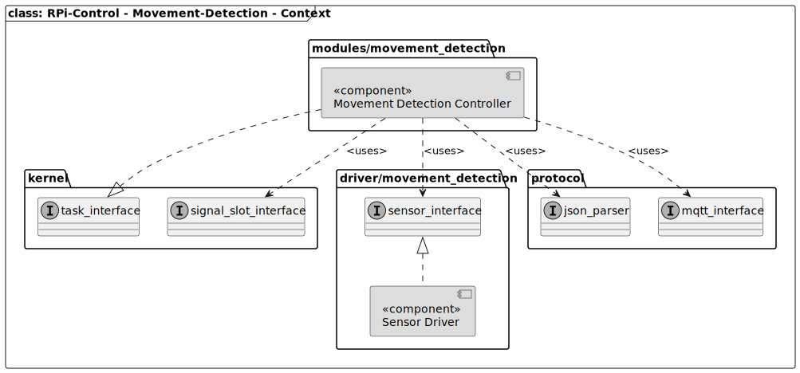

[TOP]: #section "Go to the top of the page"

[Signal-Slot-Interface]: ../../../../readme/readme_signal_slot.md "SW-IRQ based communication system used in the rpi-control firmware"
[MQTT-Interface]: ../../../protocol/mqtt/readme/readme_mqtt_interface.md "Interface to the MQTT communication system"
[JSON-Parser]: ../../../protocol/json/readme/readme_json_parser.md "Implementation to create JSON formated strings"
[Movement-Detection-Drivers]: ../../../driver/movement_detection/readme/readme_movement_detection.md#section "List of drivers to be used by the movement-detection controller"

<br>

### Section

Readme | [Changelog](../../../../changelog.md)

<br>

### Location
[frmwrk](../../../../README.md) / [modules](../../readme_modules.md) / MOVEMENT-DETECTION

<br>

# MOVEMENT-DETECTION

<br>

### Content

<details>
<summary> Click to open</summary>

[Brief](#brief)\
[Features](#features)\
[Solution Strategy](#solution-strategy)\
[Structure](#structure)\
&nbsp;&nbsp;&nbsp;&nbsp;[Context](#context)\
[Runtime](#runtime)\
&nbsp;&nbsp;&nbsp;&nbsp;[State-Machine](#state-machine)\
[Interface](#interface)\
&nbsp;&nbsp;&nbsp;&nbsp;[Sensor Interface](#sensor-interface)\
&nbsp;&nbsp;&nbsp;&nbsp;[Signals](#signals)\
&nbsp;&nbsp;&nbsp;&nbsp;[Configuration Macros](#configuration-macros)\
&nbsp;&nbsp;&nbsp;&nbsp;[JSON message](#json-message)\
[Integration](#integration)\
&nbsp;&nbsp;&nbsp;&nbsp;[Makefile](#makefile)\
[Usage](#usage)\
&nbsp;&nbsp;&nbsp;&nbsp;[Initialization](#initialization)

</details>

<br>

## Brief
[[TOP]]

The movement-detection module can recognize moving objects in front of the system.
E.g. via a PIR sensor. If an object was recognized a signal is generated and send via the systems messages bus.

<br>

## Features
[[TOP]]

... comming soon ...

<br>

## Requirements
[[TOP]]

[REQ_MOVEMENT_01_DECT_MOVMENT]: #Requirements "Requirement that movement-detection needs to be fulfilled"
[REQ_MOVEMENT_02_VERIFY_DETECTION]: #REQ_MOVEMENT_02_VERIFY_DETECTION "Requirement that verify of detected movement is necessary"
[REQ_MOVEMENT_03_SENSOR_INDEPENDENCE]: #REQ_MOVEMENT_03_SENSOR_INDEPENDENCE "Requirement that movement-detection is independent of the HW-sensor"
[REQ_MOVEMENT_04_USE_SYSTEM_MSG_BUS]: #REQ_MOVEMENT_04_USE_SYSTEM_MSG_BUS "Requirement that the current system-wide message bus is used for sending signals and information"
[REQ_MOVEMENT_05_POWER_DOWN_MODE]: #REQ_MOVEMENT_05_POWER_DOWN_MODE "Requirement that the module can be set into a power down mode to save energy."
[REQ_MOVEMENT_06_OPTIONAL_MQTT_MSG]: #REQ_MOVEMENT_06_OPTIONAL_MQTT_MSG "Optional feature to send a json formated MQTT message to a MQTT-broker."

| ID | Title | Description | *Status |
|----|-------|-------------|--------|
| [REQ_MOVEMENT_01_DECT_MOVMENT] | Detect Movement | The movement-detection module must detect movement in front of the system.  | CONCEPT |
| [REQ_MOVEMENT_02_VERIFY_DETECTION] | Verify-Detection  | If a movement was detected the module shall check if the movement is still present after a short amount of time. (50ms <= t <= 1 sek). It is possible that there occur false positives. E.g. temperature variations. | IMPLEMENTED |
| [REQ_MOVEMENT_03_SENSOR_INDEPENDENCE] | Independend from sensor | The movement-detection module must not depend on a specific sensor-model. The movement-detection module shall not be modified if the sensor-model has changed. | CONCEPT |
| [REQ_MOVEMENT_04_USE_SYSTEM_MSG_BUS] | Use SIGNAL/SLOT msg-bus | In case a movement was detected and verified a signal shall be send via the system message-bus. Other modules can conenct to that signal to perform a operation in case movement is detected. | IMPLEMENTED |
| [REQ_MOVEMENT_05_POWER_DOWN_MODE] | ENABLE/DISABLE power down | The module has the ability to enter a power down mode. In this mode movement-detection is disabled. The power-down mode is used in sittuations where movement detection is not needed. | CONCEPT |
| [REQ_MOVEMENT_06_OPTIONAL_MQTT_MSG] | Send JSON formated MQTT-MSG | This is an optional feature to send a MQTT-message to the currently connected MQTT-broker. Here optional means, that this feature can be activated/deactivated, e.g. at compile time. The message uses a JSON data format. The data may include the following information. Timestamp, Location | CONCEPT |

****Status***: the following states apply on the status field
- **DEFINED** - The requirement has been defined only.
- **CONCEPT** - There is a concept available how to realize the requirement
- **IMPLEMENTED** - The requirement has been implemented. There is a test-system available
- **VERIFIED** - The funcitonality of the reuirement has been verified. E.g. there is a unittest available and the feature was tested over a long period on the test-system.

<br>

## Solution Strategy
[[TOP]]

This section describes how to realize each requirement.

| ID | Concept | Solution |
|----|---------|----------|
| [REQ_MOVEMENT_01_DECT_MOVMENT] | The movement-detection sensor is accessed via a interface to check if there was a movement in front of the system | - |
| [REQ_MOVEMENT_02_VERIFY_DETECTION] | The movement-detection module is implemented as a state-machine if there is a movement event in the idle state the state machine will go into a verify state. If there is one more movement event, the movement has been verified and a signal is send | See MOVEMENT_DETECT_CONTROLLER_TASK_execute in movement_detection_controll.c |
| [REQ_MOVEMENT_03_SENSOR_INDEPENDENCE] | The sensor-HW is accessed via a interface. There is no direction communication between the movement-detection module and the sensor-HW. The interface is defined by the movement-detection module and implemetned by the sensor driver. | See movement_detect_sensor_interface.h |
| [REQ_MOVEMENT_04_USE_SYSTEM_MSG_BUS] | The [Signal-Slot-Interface] is used to gneereate system-signals | See declaration of MOVEMENT_DETECT_SIGNAL in movement_detection_controller.c |
| [REQ_MOVEMENT_05_POWER_DOWN_MODE] | Using an additional state where movement-detection is disabled. The state is entered/leaved by receiving signals | See state MOVEMENT_DETECTION_STATE_POWER_DOWN in movement_detection_controller.c |
| [REQ_MOVEMENT_06_OPTIONAL_MQTT_MSG] | Use [MQTT-Interface] and [JSON-Parser]. Feature needds to be activated via compile-switch in makefile | See section XXX for the definition of the [JSON message](#json-message). The message is transfered to the MQTT interface by using the signal `MQTT_MESSAGE_TO_SEND_SIGNAL` to let the MQTT-application transmit the message on the next schedule. |

<br>

## Structure
[[TOP]]

<br>

### Context



<br>

## Runtime
[[TOP]]

<br>

### State-Machine


| State              | Description |
|--------------------|-------------|
| SETUP              | Activate the movement-dectection sensor. |
| WAIT_FOR_MOVEMENT  | Wait for a movement by checking the sensor periodically. |
| WAIT_TO_VERIFY     | Wait a short amount of time. Before verifying the movment. If a movement was detected a timeout is started on elaving this state |
| VERIFY             | Check once again if the first event can be aproved. Go back to the IDLE state if the timeout triggers. |
| SIGNALING          | A movement was detected and verified. A signal is send via the msg-bus system.  |
| PAUSE              | Wait for a time-interval before start checking fo the next movement. The sensor is deactivated in this state  |
| POWER_DOWN         | State to safe energey. If in this state there is no movement detection available.  |

<br>

## Interface
[[TOP]]

<br>

### Sensor Interface

See [modules/movement_detection/movement_detect_sensor_interface.h](../../../modules/movement_detection/movement_detect_sensor_interface.h) for details.

| Function          | Description                                   |
|-------------------|-----------------------------------------------|
| power up          | Wakes up the sensor from power down mode      |
| power down        | Enters the power down mdoe to safe energy. The current sensor maybe does not has a power down mode. |
| is movement       | checks if there is a movement detected or not. |
| configure         | Configures the sensor with proj               |
| reset             | Resets the sensor to its default state. The sensor maybe needs to be reconfigured. |

<br>

### Signals

| Signal-Name                         | Direction | Arguments | Description |
|-------------------------------------|-----------|-----------|-------------|
| `MOVEMENT_DETECT_SIGNAL`            | SEND      | none      | Is send in case there was a movement detected and verified |
| `MOVEMENT_DETECT_POWER_DOWN_SIGNAL` | RECEIVE   | none      | If this signal is received, the module goes into power down mode |
| `MOVEMENT_DETECT_POWER_UP_SIGNAL`   | RECEIVE   | none      | If this signal is received the module leaves power down mode, if entered previously |

<br>

### Configuration Macros

The following values can be defined as a macro. E.g. in your project specific `config.h`\
See [modules/movement_detection/movement_detection_controller.h](../../../modules/movement_detection/movement_detection_controller.h)

| Configuration Macro                                       | Default Value | Description                 |
|-----------------------------------------------------------|---------------|-----------------------------|
| `MOVEMENT_DETECTION_CONTROLLER_SCHEDULE_INTERVAL_MS`      | 100           | Interval at which the controller checks the sensor for detected movement |
| `MOVEMENT_DETECTION_CONTROLLER_WAIT_TO_VERIFY_TIMEOUT_MS` | 500           | Time in milliseconds to wait before verify a movement. |
| `MOVEMENT_DETECTION_CONTROLLER_VERIFY_TIMEOUT_MS`         | 1000          | Time in milliseconds to verify a movement. If this time is up, there is no movement. |
| `MOVEMENT_DETECTION_CONTROLLER_PAUSE_TIME_MS`             | 1000          | Pause interval in milliseconds after a successful movement detection. |

<br>

### JSON message

The following format is used for the JSON message that is transfered via MQTT in case a movement is detected.

```JSON
"MOVMENT":{
    "LOCATION": "<location-name>",
    "TIMESTAMP": <utc-timestamp>
}
```

| Value     | Description |
|-----------|-------------|
| LOCATION  | Name of the shc client the movment detection is running on. |
| TIMESTAMP | UTC timestamp in milliseconds, at which the movement was detected. |

<br>

## Integration
[[TOP]]

<br>

### Makefile

Add the following statement to your project makefile. Remember to also select a
suitable movement-detection driver, see [Movement-Detection-Drivers].
This will define the macro `MOVEMENT_DETECTION_CONTROLLER_AVAILABLE`.

```make
MODULES_CFG += MOVEMENT_DETECTION
```

The following statement will activate the MQTT feature.
This defines the macro `MOVEMENT_DETECTION_MQTT_AVAILABLE`.
<br>
The movement detection feature is activated, even if the above statement is not set.
This means the macro `MOVEMENT_DETECTION_CONTROLLER_AVAILABLE` is alse defined.

```make
MODULES_CFG += MOVEMENT_DETECTION_MQTT
```

<br>

## Usage
[[TOP]]

<br>

### Initialization

Add the following code block to your initialization routine.
Do not forget to include the header file.

```c
#include "modules/movement_detection/movement_detection_controller.h"
```

```c
#ifdef MOVEMENT_DETECTION_CONTROLLER_AVAILABLE
{
    movement_detection_controller_init();
}
#endif
```

The following drivers and modules need to be initialized before.
- System
    - Clock
    - RTC
    - GPIO 
    - Signal-Slot
- Task
- MQTT-Application
